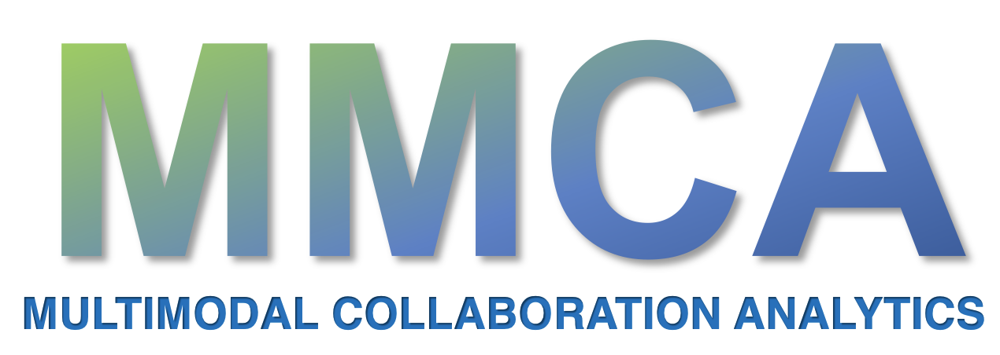

MMCA represents the field of multimodal collaboration analytics which utilizes different sensor technologies to gain insights into the group's behavior during group work to enhance the group's collaboration.

We present the current state-of-the-art in MMCA with our extensive literature review of research studies published since 2000. The review offers insights into the current trends in MMCA, challenges faced by researchers, and research areas where more research efforts are needed. 

This repository primarily contains two main components

* **MMCA Review library**: This library aims to allow easier access to our literature review dataset through Python. Additionally, the library also provides some utility functions, e.g., filtering papers based on a time interval, and plotting trends for different coded attributes of papers (e.g., metrics, outcomes).   Read the documentation [here](https://github.com/hgse-schneider/mmca-visualizations/blob/main/MMCA_library.md)    Check some analysis examples [here](https://github.com/hgse-schneider/mmca-visualizations/blob/main/source_codes/Trends.ipynb)

* **Dashboard Generator**: The dashboard generator utilizes the MMCA review library and generates a web-based dashboard for the users. The dashboard allows users to explore the review dataset in terms of metric-outcome relationships, and filter papers as per their needs.   Read [here](https://github.com/hgse-schneider/mmca-visualizations/blob/main/Dashboard.md) the steps to generate the dashboard

Copyright (c) 2024 [Learning, Innovation, and Technology Lab](https://lit.gse.harvard.edu/) at Harvard University, USA

Permission is hereby granted, free of charge, to any person obtaining a copy
of this software and associated documentation files (the "Software"), to deal
in the Software without restriction, including without limitation the rights
to use, copy, modify, merge, publish, distribute, sublicense, and/or sell
copies of the Software, and to permit persons to whom the Software is
furnished to do so, subject to the following conditions:

The above copyright notice and this permission notice shall be included in all
copies or substantial portions of the Software.

THE SOFTWARE IS PROVIDED "AS IS", WITHOUT WARRANTY OF ANY KIND, EXPRESS OR
IMPLIED, INCLUDING BUT NOT LIMITED TO THE WARRANTIES OF MERCHANTABILITY,
FITNESS FOR A PARTICULAR PURPOSE AND NONINFRINGEMENT. IN NO EVENT SHALL THE
AUTHORS OR COPYRIGHT HOLDERS BE LIABLE FOR ANY CLAIM, DAMAGES OR OTHER
LIABILITY, WHETHER IN AN ACTION OF CONTRACT, TORT OR OTHERWISE, ARISING FROM,
OUT OF OR IN CONNECTION WITH THE SOFTWARE OR THE USE OR OTHER DEALINGS IN THE
SOFTWARE.
